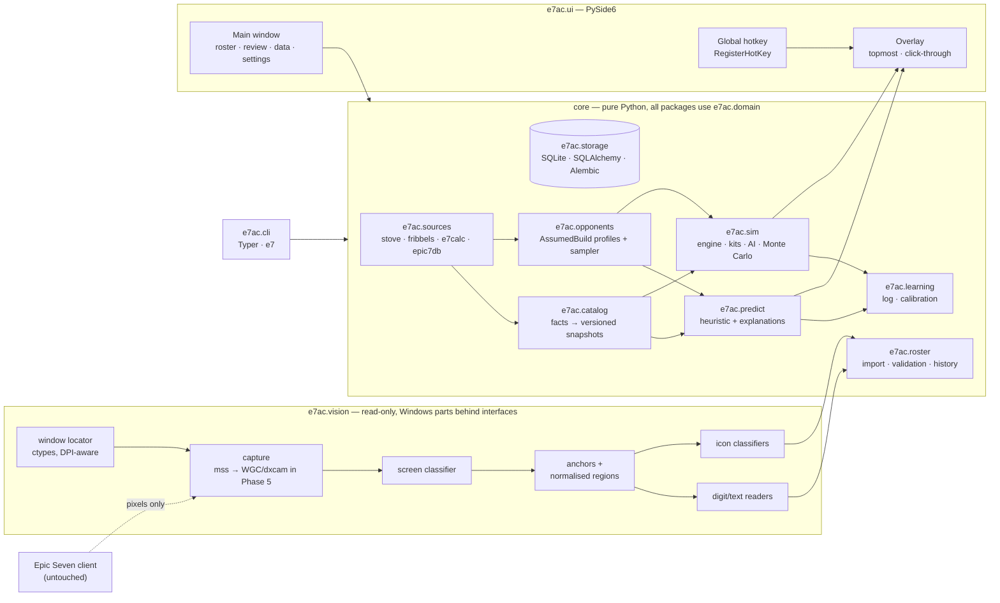
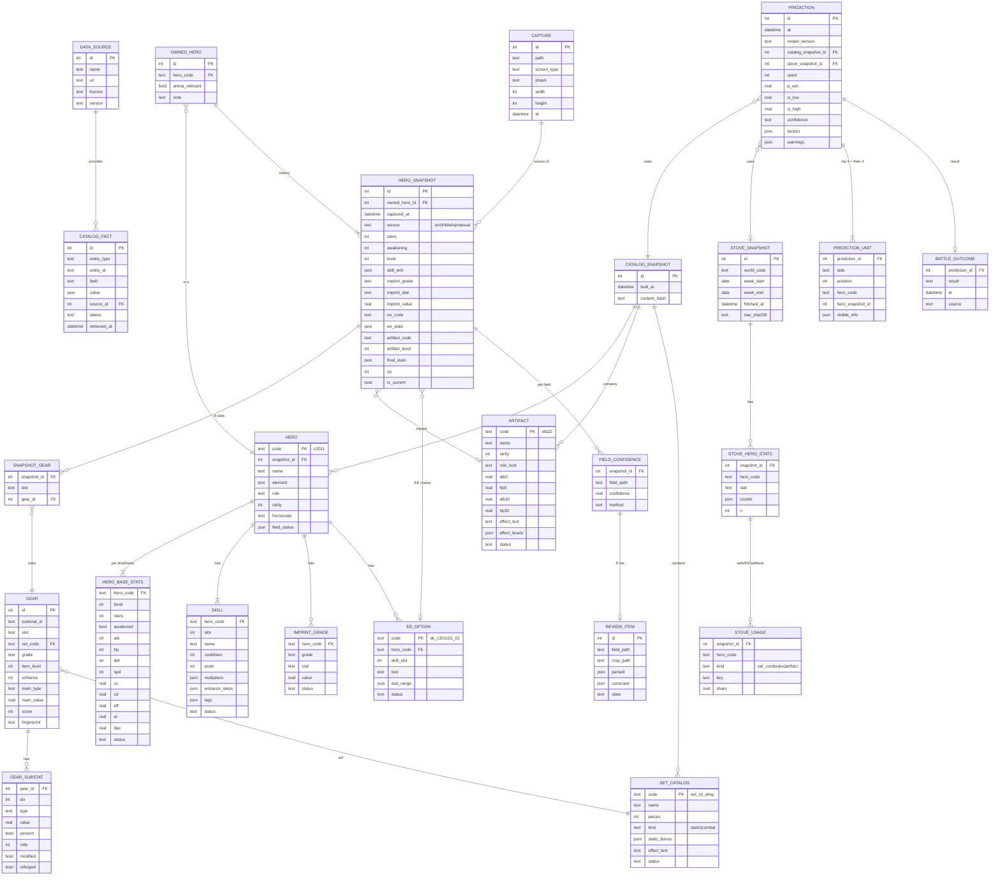

# Architecture

Status: **accepted** (SPEC D11); implemented through **M1**. Decisions are logged in `docs/SPEC.md`.

## 1. Principles
- **Core is UI-free and fully usable from the CLI** (`e7 …`). Qt only lives in `e7ac.ui`.
- **Read-only towards the game**: screen capture + CV/OCR only. No memory access, injection, network
  interception or input automation — enforced by code review rules and by not depending on any
  library that does those things (no `pymem`, `pyautogui`, `keyboard` hooks, packet capture).
- **Provenance everywhere**: every catalog datum carries `source` + `status`; every parsed field carries a
  confidence; every prediction records model version, data snapshot ids and seed.
- **Local-first**: one SQLite file + an on-disk cache under `%LOCALAPPDATA%\OrbisCodex\`; works offline after sync.
- **Typed core**: `mypy --strict` on `e7ac.domain`, `e7ac.catalog`, `e7ac.roster`, `e7ac.predict`, `e7ac.sim`.

## 2. Component diagram



Prediction flow (Phase 3+): hotkey → capture Arena list (Phase 5; manual entry before) → opponent teams →
heuristic result shown instantly in overlay → simulator runs in a worker process pool → overlay refines →
everything logged → outcome logged from the result screen → calibration.

## 3. Package layout (proposed)

```text
OrbisCodex.cmd   # end-user launcher (M1)
scripts/         # install-uv.ps1 (M1)
src/e7ac/
  paths.py       # data home (%LOCALAPPDATA%\OrbisCodex, E7AC_HOME override)            [M1]
  settings.py    # settings.json: client, world, display mode, resolution               [M1]
  doctor.py      # environment self-check                                              [M1]
  domain/        # pydantic v2 models: World [M1]; HeroCode, Stat, Gear, OwnedHeroSnapshot, AssumedBuild, Confidence…
  sources/       # stove/, fribbels/, e7calc/, epic7db/ — fetch (httpx, cache, rate limit) + strict parsers
  catalog/       # fact store, merge/resolve rules, snapshots, coverage/conflict reports
  roster/        # importers (ocr, fribbels, manual), validation rules, history, JSON backup
  vision/        # capture, window, screens, anchors, ocr engines, icon classifiers, labelling tool
  opponents/     # histogram model, profiles (P50/P75/P90), sampler, CP calibration
  predict/       # features, heuristic model, explanation text
  sim/           # engine, status effects, hooks, kits (YAML + python), ai policies, runner
  learning/      # prediction log, metrics (Brier, log loss, reliability), Platt/isotonic, Beta memory
  storage/       # SQLAlchemy models, repositories, Alembic env
  ui/            # PySide6 main window, review screen, overlay, hotkey
  cli/           # Typer app: e7 catalog|roster|import|predict|sim|data …
kits/            # hero/artifact kit files (YAML), each citing sources, with tests
migrations/      # Alembic
tests/           # unit, property (hypothesis), golden (skip if fixtures missing), sim regressions
spikes/          # throwaway experiments (not imported by src/)
docs/
```

## 4. Stack

| Concern | Choice | Why / alternatives |
|---|---|---|
| Language/runtime | **Python 3.12**, **uv** | As recommended; uv gives fast reproducible envs + lockfile. |
| Domain & I/O models | **pydantic v2** | Validation with clear errors; strict parsing of Stove/Fribbels payloads. |
| Persistence | **SQLite + SQLAlchemy 2.0 (typed `Mapped[]`) + Alembic** | Deviation: **not SQLModel**. SQLModel couples table and API models, lags SQLAlchemy 2 features and is awkward under `mypy --strict` with history/versioned tables. Domain stays in pydantic; thin mappers in `storage`. |
| HTTP | **httpx** | Sync client is enough; own small file cache + rate limiter (no extra caching lib). |
| CLI | **Typer** | Small (click + rich), typed signatures. |
| Fuzzy matching | **rapidfuzz** | Fast, MIT; used with a margin rule (best − second best ≥ threshold, else ask). |
| CV | **opencv-python-headless**, **numpy** | *Headless* build avoids Qt plugin conflicts with PySide6. |
| OCR | **decided by benchmark (M5b)** — leading candidate RapidOCR (`rapidocr` 3.x + `onnxruntime`, ≈ 42 MB download, PP-OCR models inside the wheel, run recognition-only on anchored regions); others: Windows.Media.Ocr (`winrt-*` packages, < 1 MB, Windows-only, no confidence), template digit reader (OpenCV, cross-check for numbers). Tesseract excluded (separate installer, D17); PaddleOCR/EasyOCR excluded (size/PyTorch) | OCR scores are not reliable confidences on small text, so every field is also checked against the catalog (margin rule) and value ranges. RapidOCR pulls the GUI `opencv-python`: override it to keep the headless build. |
| Icons | Template matching (NCC) + tiny kNN on normalised crops | No deep learning, no PyTorch. Templates bootstrapped from user screenshots + Stove set icons. |
| Capture | **mss** now (M5a: GDI copy of the window's client area, game must be visible); **Windows Graphics Capture** (`windows-capture`) added with the overlay (M9), because it captures only the game window (not our overlay on top); dxcam only as a benchmark candidate | mss is 70 KB, pure ctypes. WGC shows a yellow border on Windows 10. BitBlt of the window DC / PrintWindow are excluded (black frames on flip-model DirectX windows). |
| Window/DPI | ctypes (user32, dwmapi, Toolhelp32 snapshot) | No pywin32 needed; process set to per-monitor-v2 DPI awareness. The executable name comes from the system process list: **no handle to the game process is ever opened** (anti-cheat software watches those). |
| UI | **PySide6** (main window + overlay) | Overlay: frameless, `WindowStaysOnTopHint`, `Tool`, translucent background, `WindowTransparentForInput` toggle for click-through. Hotkey via `RegisterHotKey` + native event filter (no keyboard hooks). |
| Numerics | numpy (Platt/isotonic implemented in ~50 lines) | Avoid scikit-learn/scipy (~70 MB) unless needed later. |
| Simulator speed | pure Python + `multiprocessing` first | numba/Rust only after profiling. |
| Paths | `platformdirs` | `%LOCALAPPDATA%\OrbisCodex\{e7ac.sqlite3,cache,captures,logs}`. |
| Quality | pytest, hypothesis, pytest-qt (UI), ruff (lint+format), mypy | CI: GitHub Actions on `windows-latest` + `ubuntu-latest`; Windows-only tests marked. |
| Install / launch | `OrbisCodex.cmd` → uv (installed by `scripts/install-uv.ps1` if missing) → `uv run --frozen --no-dev e7` | Zero manual setup for a non-technical user (D17, D20); uv downloads Python 3.12 + locked wheels. CI job simulates a clean PC (uv absent, managed Python only). |

Dependency size is accepted by the user (D17) as long as everything installs automatically through uv (wheels only,
no separate system installers): PySide6 (~100 MB), opencv-headless (~40 MB), RapidOCR + onnxruntime (~30 MB, if it wins M5).

## 5. Vision pipeline (Phase 1)

1. **Locate window** (client profile: executable / window class / title; `--hwnd` override; never guesses between
   several candidates) → client rect in physical pixels. Implemented in M5a (`vision/window.py`, `vision/_win32.py`).
2. **Classify screen** by a few cheap template anchors (e.g. Hero Info layout markers).
3. **Normalise**: find 2+ anchors → affine transform to a reference layout (resolution independent);
   regions are defined in reference coordinates (fractions), never in raw pixels.
4. **Read fields**: digits via template reader; text via the chosen OCR; icons via classifiers; "%" glyph
   detection decides flat vs percent; grade from frame colour (HSV clusters); slot from position.
5. **Constrain & score**: cross-field rules (main/sub types, ranges per item level, no duplicates,
   sums vs displayed final stats) adjust confidences; nothing is silently "fixed".
6. **Review**: fields under threshold go to a review queue showing crop + parsed value.
7. **Dedupe** (scan mode): key = hero code + CP (+ perceptual hash of stats panel); unchanged → skip.

## 6. Data model

> **As built in M2 (D21):** the catalog is stored as `catalog_snapshot` + `catalog_fact` (every fact with source/status) +
> `catalog_entity` (one resolved JSON document per hero/skill/artifact/set, validated by pydantic on read). The typed
> catalog tables below (HERO, SKILL, ARTIFACT, SET_CATALOG, …) describe the *logical* model; they are not separate
> SQL tables because the catalog is small (~1.7k entities), read-mostly and versioned as a whole. Roster tables (M3) will
> be typed SQL tables.



Notes:
- **History**: `HERO_SNAPSHOT` rows are immutable; editing creates a new snapshot and flips `is_current`. A partial unique
  index allows at most one current snapshot per owned hero (SPEC D32).
  `GEAR` rows are shared when (`fingerprint`, `external_id`, `score`) are equal; the fingerprint covers slot, set, grade,
  level, enhance, main and every substat with rolls/modified/reforged (SPEC D35).
- `final_stats` (displayed) are the combat truth; components are kept for validation and what-ifs.
- `field_status` / `status` columns carry provenance into the predictor's confidence computation.

## 7. Risks and mitigations

| # | Risk | Impact | Mitigation |
|---|---|---|---|
| R1 | **Simulator kit coverage** (~400 heroes, bespoke mechanics, balance patches) | Simulator wrong or unusable for many matchups | Coverage-aware blend with the heuristic; generic kit from tags + multipliers (Fribbels/e7calc) with lowered confidence; prioritise kits by my roster + defences seen in my log; every kit cites sources and has tests; patch-versioned catalog. |
| R2 | **Stove data access**: undocumented API may change, rate-limit or block | No opponent model refresh | Cache + last-good snapshot; strict schema → loud failure; polite access; lazy per-hero fetch; the app keeps working on stale data with a visible "data age" warning. |
| R3 | **Stove data semantics**: bin edges inferred; population not Arena-specific; endpoints disagree | Biased opponent builds | Edges configurable + flagged `assumed`; profile choice (P50/P75/P90) + CP calibration from the Arena screen; outcome-based calibration; document the marginal-independence approximation. |
| R4 | **OCR of icons** (substat types are icon-only; set icons; grade colours) | Wrong builds imported silently | Template classifiers with margins; constraint solving (stat value ranges imply type); "%" detection; per-field confidence + review UI; golden fixtures; labelling tool to grow templates. |
| R5 | **Unknown defence AI** | Simulator bias | Pluggable policies; start with documented community rules marked `community/assumed`; widen uncertainty; learn from logged outcomes (Phase 6). |
| R6 | **Capture blocked / anti-cheat** (some clients return black frames to capture APIs); several clients (Stove PC now, Steam soon, GPG/emulators) | No automation | Client profiles with per-client capture hints; benchmark mss/WGC/dxcam early on each client; always allow manual screenshot import (Win+Shift+S / Print Screen folder). Never inject or hook. |
| R13 | **Overlay button focus**: clicking our overlay could steal focus from a borderless game | Annoying UX | Non-activating overlay window (`WS_EX_NOACTIVATE`) so a click on "Scan" does not deactivate the game; still never sends input to the game. |
| R7 | **Resolution, DPI, aspect ratio, language** | OCR regions misaligned | Anchor-based normalisation; tests on synthetic rescales; game language fixed to English (configurable later). |
| R8 | **Hero name ambiguity** (Karin vs Blood Blade Karin) | Wrong hero | Hero codes as keys; fuzzy match only with a margin rule; ambiguous → review; portrait check as tiebreaker. |
| R9 | **Licensing / ToS** | Repo takedown, account risk | No game data, assets or screenshots committed; data synced locally; attribution in DATA_SOURCES; read-only tool. |
| R10 | **Monte Carlo too slow** (< 5 s target for 3 matchups) | Overlay lag | Adaptive stopping (95% CI half-width < 3 pp), worker pool, profile before numba/Rust; heuristic shown instantly. |
| R11 | **Small sample for calibration** | Over-confident outputs | Beta priors, wide intervals until ~50 outcomes, reliability curve on the dashboard. |
| R12 | **Development without Windows/the game** (this cloud environment is Linux) | Windows-only code untested | Interfaces + fakes; CI on `windows-latest`; per-milestone manual test checklist for the user; golden fixtures. |
