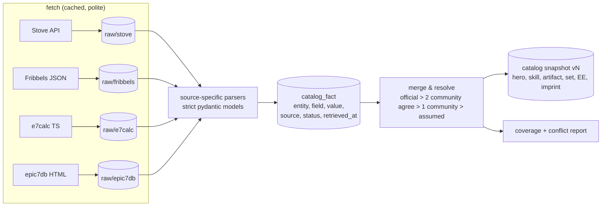

# Data sources

Every external source the project uses or evaluated: what it provides, how it is accessed,
freshness, licence/ToS notes and the date it was last verified.

Status vocabulary used for every datum (see `docs/MECHANICS.md` for rules):

| Status | Meaning |
|---|---|
| `verified` | Official source (Stove, in-game text) or reproduced from an in-game observation / golden fixture |
| `community` | Taken from one or more community sources; two independent sources agreeing raises confidence |
| `assumed` | Inferred, defaulted or extrapolated by us; lowers prediction confidence and is listed under "needs verification" |
| `unknown` | Missing; the consumer must degrade gracefully |

## Summary

| Source | Provides | Access | Freshness | Licence / ToS | Use | Last verified |
|---|---|---|---|---|---|---|
| **Stove Strategy Guide** (official) | Hero list + codes, element/class/rarity, per-region stat histograms, set-combo / EE / artifact usage, set effect text, artifact stats + effect text, portraits/icons | Public JSON API `api.onstove.com/pub-meta/v1.0/epic7/guide/…` (no auth) | Weekly (Thu 03:00 UTC) | Official site; robots allow; ToS not yet reviewed in detail → personal use, polite | **Primary** for opponent model + catalog IDs | 2026-10-03 |
| **Fribbels E7 Optimizer** data | Base stats (Lv50 5★ / Lv60 6★ awakened), imprint values per grade, EE stat type, skill multipliers (rate/pow/targets/hit types), horoscope, artifact base stats | `raw.githubusercontent.com/fribbels/Fribbels-Epic-7-Optimizer/main/data/cache/{herodata,artifactdata}.json` | Updated per patch (last commit 2026-09-26, "patch 20260918") | `app/package.json` says MIT; no root LICENSE file | **Primary** for base stats & multipliers; save-file import | 2026-10-03 |
| **e7calc** (`tyopoyt/epic7-damage-calc`, e7calc.xyz) | Skill multipliers incl. enhancement steps, hero-specific damage mechanics, artifact damage effects, battle constants, damage/EFF/speed-tuning formulas | Git repo (TypeScript source, not JSON) | Updated per patch (last commit 2026-09-24, "Add balance patch changes") | Root `package.json` says ISC; no LICENSE file | Cross-check + kit-authoring reference | 2026-10-03 |
| **epic7db.com** | Skill text, cooldowns, soul gain, enhancement steps, imprint table, awakening, base stats | HTML only (no JSON API found) | Active (BETA) | robots allow all; no licence stated | Skill text / cooldowns (scrape politely, cache) | 2026-10-03 |
| epic7x.com | Character pages, skill multipliers page | HTML (WordPress) | Unknown | robots allow; copyright | Secondary reference only | 2026-10-03 |
| EpicSevenDB API | (was) full hero/artifact DB | `api.epicsevendb.com` | **Dead**: 502 on 2026-10-03; GitHub repo archived 2023-02-18 | — | Not used | 2026-10-03 |
| In-game screens (user) | Ground truth for owned heroes; skill text | Screen capture + OCR (read-only) | Live | User's own data | Roster import, verification | — |

Evaluated and rejected / low value: `maphe/e7-damage-calc` (unmaintained, points to e7calc),
`PThanapon/e7herodata` (scraped epic7x, last update 2025-08), Fandom wiki "Combat Power" page
(incomplete), Game8 "Battle System" (2020, used only as a dated community note on Arena AI),
GameFAQs threads (anecdotal), NamuWiki (HTTP 403 from our environment; may be worth reading manually).

---

## 1. Stove Strategy Guide (official)

### How the page loads its data
- `epic7.onstove.com/{lang}/guide/*` is a **Nuxt 3 SPA**. The server-rendered HTML only embeds
  i18n strings (`__NUXT_DATA__` → `epic7_202502_StrategyMultilang.json`); all game data is fetched
  client-side with plain `GET` requests returning JSON. No cookies, tokens or JS rendering needed →
  **httpx is enough; Playwright is not required.**
- API base (`stoveApiUrl` in the Nuxt runtime config): `https://api.onstove.com`.
- The in-game "Strategy Guide" link opens `/en/guide/getHeroDetailGame?hero=<code>&world=<world>`,
  which calls `hero-detail-for-game` (below).
- Static assets base (`staticUrlGuide`): `https://static-pubcomm.onstove.com/event/live/epic7/guide`.

### Endpoints (all `GET`, JSON envelope `{"code":0,"message":"OK","value":{…}}`)

Base: `https://api.onstove.com/pub-meta/v1.0/epic7/guide`

| Endpoint | Params | Returns |
|---|---|---|
| `hunt/hero-detail-for-game` | `world_code`, `lang_code`, `hero_code`, `strategy_type`, `stage`, `boss_type` | Per-hero stat histograms, top-3 set combos, top-3 EE options, top-3 artifacts, skill names/icons, hero meta |
| `hunt/hero-detail` | same | Same payload; used by the popup on site pages (not exercised yet) |
| `wearing-status/hero-list` | `world_code`, `lang_code`, `current_page`, `is_paging` (`Y`/`N`), `keyword` | All heroes with `hero_code`, `hero_name`, `grade` (base ★), `job_code`, `attribute_code`; 390 heroes, 50/page |
| `wearing-status/equip-list` | `world_code`, `lang_code`, … | 24 sets: `equip_code`, `equip_name`, **official effect text** |
| `wearing-status/artifact-list` | `world_code`, `lang_code`, … | Artifact catalog (same item shape as below) |
| `wearing-status/hero-equip-ranking` | + `hero_code` | Per-hero usage share of **individual** sets (all 24) |
| `wearing-status/hero-artifact-ranking` | + `hero_code` | Per-hero artifact usage (30 entries) with artifact stats and effect text |
| `wearing-status/equip-hero-ranking`, `artifact-hero-ranking` | + `equip_code` / `artifact_code` | Reverse rankings (not needed) |
| `wearing-status/last-update-time` | `world_code`, `lang_code` | `week_start_date`, `week_end_date`, `ranking_renew` |
| `hunt/hero-ranking`, `hunt/hero-team-ranking`, `abyss-challenge/*`, `crack/*` (Rift), `expedition/*` | various | PvE content rankings — not needed |

`strategy_type` values (from the page bundles): `0` = Equipment/Artifact statistics ("wearing status",
general), `1` = Hunt, `2` = Abyss, `3` = Abyss Challenge, `4` = Expedition, `6` = Rift.
The in-game page uses `strategy_type=0, stage=1, boss_type=1` — **this is the one we use.**

`world_code` (region): `world_global`, `world_eu`, `world_asia`, `world_kor`, `world_jpn`. Data differ per region.

Example: `…/hunt/hero-detail-for-game?world_code=world_global&stage=1&lang_code=en&hero_code=c2011&strategy_type=0&boss_type=1`

### `hero-detail-for-game` payload (observed 2026-10-03, Blood Blade Karin `c2011`, Global)
```text
seq, hero_code, world_code, strategy_type, boss_type, floor, reg_date ("2026-10-01 10:34:18.607")
attack_stats, defense_stats, vitality_statistics (HP), speed_statistics,
critical_statistics (crit chance), critical_hit_statistics (crit damage),
effective_statistics (effectiveness), effect_resistance_statistics   -> "c0,c1,…,c9" (10 integer counts)
hero_eqips:          [{rank_sets: "cri_dmg,torrent", eqip_rank_share: 27.5}, …]       (top 3 combos, %)
hero_dedicated_eqip: [{rank_skill: "ek_c201101_01", enhancemen_skill: "2", skill_rank_share: 84.92}, …] (top 3 EE options)
hero_arti:           [{rank_arti: "efa15", arti_rank_share: 35.6, rank_arti_name: "Shepherd of the Hollow"}, …] (top 3)
hero_skills:         [{skill_name, skill_url}] ×3
grade, job_code, attribute_code, hero_name
```
- `seq == 0` means "no data for this hero" (front-end shows "Gathering Hero Information").
- Heroes without EE return EE entries with `skill_rank_share: 0.0` and no code.
- `enhancemen_skill` (sic) = which skill (1–3) the EE option modifies. **EE stat type/value and option text are not provided.**
- Set combo strings use set codes without the `set_` prefix; repeated codes = several 2-piece sets
  (e.g. `max_hp,max_hp,max_hp`, `speed,max_hp`). Only the top 3 combos are given; the rest is "other".

### Histograms: what we know about the bins
- The API returns **counts only, no bin edges.** The front-end component `HeroDetailStat` draws
  10 bars per stat and labels only the ends with **hard-coded constants**:

  | Stat | Label min | Label max | Implied width (if equal-width) |
  |---|---|---|---|
  | Attack | 1200 | 5200 | 400 |
  | Defense | 800 | 2400 | 160 |
  | Health | 9000 | 25000 | 1600 |
  | Speed | 110 | 270 | 16 |
  | Crit Chance % | 15 | 100 | 8.5 |
  | Crit Damage % | 150 | 350 | 20 |
  | Effectiveness % | 0 | 180 | 18 |
  | Effect Resistance % | 0 | 225 | 22.5 |

- **Totals are identical across all 8 histograms** for every hero/region checked (e.g. BBK Global
  n = 68,898 in each) → out-of-range values are **not dropped**; they must be **clamped into the
  first/last bin** (also consistent with BBK's last Crit Damage bin holding 59% of the population,
  since many BBKs exceed 350%).
- Bin edges are therefore modelled as: equal-width bins between the label bounds, with bin 0
  open to −∞ and bin 9 open to +∞. **Status: `assumed`** (inferred from front-end constants + totals).
  Edges are stored as configuration so they can be corrected without code changes.
- The UI only renders each bar as one of 5 heights (`ceil(count/total·100/20)`), so the raw counts
  are strictly more informative than the page.
- Caveat seen in data: BBK Defense puts 63% of instances in 960–1120 under this assumption, which is
  plausible for bruiser builds but unconfirmed → to verify against the user's own roster.

Worked example (BBK, Global, n = 68,898; percentiles by linear interpolation inside bins):

| Stat | P50 | P75 | P90 | Counts |
|---|---|---|---|---|
| ATK | 3775 | 3996 | 4267 | 0,13,189,477,3675,16443,31217,14989,1855,40 |
| DEF | 1010 | 1073 | 1111 | 20774,43737,3815,502,70,0,0,0,0,0 |
| HP | 11977 | 13047 | 13742 | 5803,33275,23786,5157,580,241,47,0,0,9 |
| SPD | 164.6 | 184.4 | 203.0 | 0,7455,18572,20471,7975,9259,3475,1556,128,7 |
| CC % | 93.4 | 96.7 | 98.7 | 0,7,75,138,604,1408,3295,8248,10814,44309 |
| CD % | 333 (top bin open) | 342 | 347 | 166,212,207,540,1689,3024,6085,7051,9040,40884 |
| EFF % | 10.4 | 15.6 | 24.1 | 59663,6926,1572,359,307,42,26,3,0,0 |
| ER % | 15.6 | 29.1 | 99.8 | 49666,6869,2493,1831,2627,2654,1754,903,94,7 |

Percentiles that fall in an open-ended edge bin are flagged as low-confidence.

### Population represented
- Site string for these statistics: **"Lv. 60 / 6★ Awakened / Fully-Equipped Hero Data"**;
  period string "User data from past 7 days". Counts are **hero instances**, not players
  (BBK Global n = 68,898).
- **Not Arena-specific**: it covers all such heroes regardless of content, so PvE builds are mixed in
  (e.g. BBK's #1 combo is Destruction + Torrent). Mitigation: CP calibration from the Arena screen
  and outcome-based calibration (Phase 2/6).
- `hero-detail` top-3 artifact shares differ from `hero-artifact-ranking` for the same hero/week
  (BBK: Shepherd of the Hollow 35.6% vs 17.74%; Ras: Aurius 37.6% vs Mighty Yaksha 35.43% first) →
  the two endpoints use different populations or denominators. **Unknown which; we use
  `hero-detail` for builds and treat the rankings as secondary.** Status `assumed`.

### Artifact items (`hero-artifact-ranking` / `artifact-list`)
`artifact_code` (e.g. `efa22`), `artifact_name`, `job_code` (class lock or `NN`), `grade` (★),
`ability_attack` / `ability_defense` at +0 and `enhance_ability_attack` / `enhance_ability_defense` at +30
(observed = 13 × +0 values). **The two fields are positional, not named**: they hold the artifact's two non-zero stats
in the order ATK, DEF, HP. Most artifacts are ATK + HP, but ATK + DEF (`efa28` Summer Photogenic 21/5,
`efw37` Thorn of the Blue Rose 9/11) and DEF + HP (`efh28` Veritas 5/76) exist; checked against Fribbels'
`{attack, defense, health}` on all 7 real artifacts that have DEF. The catalog therefore stores a slot as `verified`
only when Fribbels' +0 values confirm which stats they are, otherwise as an `assumed` ATK/HP reading (2 artifacts:
`ef506`, `ef427`, whose Fribbels entries are duplicated and disagree).
`info_text` with `@`, `@@`, `@@@` placeholders, `level_list[i] = {lv01, lv_max}` for placeholder `i+1`.
`level_list` always has 5 entries; unused ones are padded with `"0"`. Example Hostess of the Banquet `efa22`:
ATK 21→273, HP 32→416.

### Catalog lists: real-data observations (M2, 2026-10-03, Global)
- `hero-list`: 390 heroes, 50 per page whatever `is_paging` says (8 pages). **Display names are not unique**: three
  different codes are called "Mercedes" (`c0001`, `c1005` on Stove, plus `c0002` in Fribbels) → name lookups must refuse
  ambiguous names.
- `artifact-list`: 267 artifacts (6 pages); one artifact (`efw33` Tyrant's Descent) has no `info_text`.
  Of 328 placeholders used in effect texts, only 189 have real values. The rest are **unknown, not zero**:
  - 106 are `"0.0%"`/`"0.0%"`, e.g. `efr17` "Hit Chance by @ and Critical Hit Damage by @@";
  - 29 are `{}`;
  - 3 are `"0"`/`"0"`;
  - 1 has only its +0 value.

  The catalog keeps one `effect_levels` entry per placeholder present in the text, turns these sentinels into `null`,
  and marks the field `assumed` unless every value is real (84 artifacts). This is reported as a warning, never
  guessed; a second source for effect values is NV-17.
- `equip-list`: 24 sets on one page; the official texts parse into static bonuses + in-combat clauses (`catalog/sets.py`).

### Freshness
- Site text: "Every Wednesday 20:00 PDT / Every Thursday 03:00 UTC (subject to change)".
- `last-update-time` (Global, 2026-10-03): week 2026-09-24 → 2026-09-30; `hero-detail` `reg_date` 2026-10-01.
- Our refresh: weekly after Thu 03:00 UTC, or on demand per hero; cache keyed by (endpoint, params, week).

### Assets (local cache only, never committed)
| Asset | URL pattern | Use |
|---|---|---|
| Hero portrait (112×112) | `{staticUrlGuide}/images/hero/{hero_code}_s.png` | Portrait recognition (Phase 5), UI |
| Set icon | `{staticUrlGuide}/wearingStatus/images/sets/set_{code}.png` | Bootstrap set-icon templates (Phase 1) |
| Artifact icon | `{staticUrlGuide}/wearingStatus/images/artifact/{code}_ico.png`, `_full.png` | Artifact recognition, UI |
| Skill icon | `{staticUrlGuide}/images/skill/sk_{hero_code}_{n}.png` (passives `pa_…`) | UI |

### Access policy
- `epic7.onstove.com/robots.txt`: allows everything except `/error`, `/inspection/`, `/html/`.
  `api.onstove.com/robots.txt`: not served (checked 2026-10-03).
- Honest User-Agent `OrbisCodex/<version> (personal, non-commercial; +<repo url>)`, ≤ 1 request/s,
  exponential back-off on errors, on-disk cache, no parallel bursts.
- Budget: a full region sync is ~8 list pages + 390 hero details (+ 780 optional rankings) ≈ 20 min at
  1 req/s. Default is **lazy**: heroes in my roster + heroes seen in Arena + on demand.
- Raw responses stored with timestamp, region and SHA-256; parsed with strict pydantic models so a
  schema change fails loudly and falls back to the last good snapshot.
- Implemented in `sources/http.py` (M2):
  - An error page served with HTTP 200 (Stove `code != 0`, non-JSON) is rejected **before** it is cached, so it
    never replaces the last good copy.
  - HTTP 429, or a host that still fails after its retries, is not contacted again for the rest of the run.
  - Whenever a stale cached copy is served, the reason (offline mode, HTTP status, unreachable host, invalid response)
    is printed as a warning and the source is flagged `[STALE]`.
  - Paginated lists are re-fetched in one go when their pages come from different list versions (different
    `total_count`, or fetched more than 10 min apart); if they still differ, a warning says so.
- ToS: not reviewed clause by clause; the user approved weekly use of the Stove API (SPEC D18). Personal, polite access;
  no redistribution: real responses are git-ignored and tests use synthetic responses.

---

## 2. Fribbels E7 Gear Optimizer

- Repo: `github.com/fribbels/Fribbels-Epic-7-Optimizer`, last commit `4e2f6a0` 2026-09-26 "update: patch 20260918".
- **`data/cache/herodata.json`** (390 heroes, keyed by display name):
  `code` (`c2011`), `_id` (slug), `name`, `rarity`, `attribute`, `role`, `zodiac`,
  `self_devotion` (imprint concentration: `type` e.g. `att_rate` + per-grade values C…SSS),
  `ex_equip` (`[{stat:{type,value}}]` — value semantics unclear: BBK shows `cri 0.06` while the user's EE shows 12%),
  `skills.S1..S3` (`hitTypes`, `rate`, `pow`, `targets`, optional `selfHpScaling`/`selfDefScaling`/`selfSpdScaling`/`penetration`, `options[]`),
  `calculatedStatus.lv50FiveStarFullyAwakened` / `lv60SixStarFullyAwakened` (`cp, atk, hp, spd, def, chc, chd, dac, eff, efr`).
- **`data/cache/artifactdata.json`** (287 artifacts, keyed by name): `name`, `rarity`, `role`, `stats {attack, health, defense}` at +0, `code`.
- Live update URLs used by the app: `http://e7-optimizer-game-data.s3-accelerate.amazonaws.com/{herodata,artifactdata}.json` (Azure mirror for CN). We prefer the GitHub raw copy (HTTPS, versioned by commit).
- Code we rely on as **reference** (not imported): stat composition (`backend/.../core/StatCalculator.java`),
  CP / EHP (`gpu/GpuOptimizerKernel.java`), set piece counts (`enums/Set.java`), artifact level scaling
  (`app/js/lib/artifact.js`), substat roll tables (`app/js/lib/reforge.js`), save format (`app/js/lib/saves.js`).
- Licence: `app/package.json` declares MIT; there is no LICENSE file at the repo root → treat as MIT
  with attribution, confirm before redistributing anything.
- Real-data observations (M2, 2026-10-03): 390 entries in `herodata.json`, of which 2 are monsters with `m…` codes
  (`m0063` Mighty Scout, `m0171` Wild Angara → skipped); `artifactdata.json` has 287 entries with **6 duplicated codes**
  (`ef315`, `ef427`, `ef506`, `efr20`, `efr25`, `efw28`) — some are renames with identical stats, some are different
  artifacts (`ef506` "Guide to a Decision" vs "Blood-Seared Moon"). Fields on which duplicates disagree are dropped with
  a warning. Several old artifacts have 0 ATK/HP where Stove has values (official wins, conflict kept).
- ⚠️ Fribbels' *auto-importer* sniffs game network traffic (scapy). **We never do that.** We only read
  the save file the user exports.

### Save file (to be derived from the user's real file)
- From the code: `{"heroes": [...], "items": [...]}` written by "Save all optimizer data"
  (default folder `Documents/FribbelsOptimizerSaves/`, also `autosave.json`).
- The 2020 sample in the repo (`testgear.json`) shows items with `gear`, `rank`, `set`, `enhance`,
  `level`, `main {type, value}`, `substats [{type, value}]`, `name`, `id`, `equippedById`, `equippedByName`,
  `locked`, `augmentedStats`, and heroes with final stats + `equipment` by slot.
- **Not assumed**: the importer schema will be derived from the user's real file (M4) and validated
  with strict models; unknown fields are preserved raw.

---

## 3. e7calc (`tyopoyt/epic7-damage-calc`, e7calc.xyz)

- Last commit `df2cdf6` 2026-09-24 "Add balance patch changes and translations". Root `package.json` licence: ISC.
- `damage-calc/src/assets/data/heroes.ts` (400 `new Hero(...)` entries): element, class, base ATK/HP/DEF,
  per-skill `rate`, `pow`, `enhance[]` steps, `isAOE`/`isSingle`/`noCrit`/`soulburn`, hero-specific modifiers as functions.
- `artifacts.ts` (89 damage-relevant artifacts), `constants.ts` (`damageConstant 1.871`, `elementalAdvantage 1.1`, buff values),
  `stat-tables.ts` (base stats by class × ★ × horoscope), `services/damage.service.ts` + `models/target.ts` (damage formula),
  `components/effectiveness-checker` (land chance capped at 85%), `components/speed-tuner` (0–5% random starting CR).
- Default branch is **`master`** (raw URL `…/tyopoyt/epic7-damage-calc/master/…`); 400 `new Hero(` entries, of which 12
  are pre-rework versions (`*_old`, ignored).
- **Base stats are tuned for its damage maths, not the in-game base stats**: they differ from Fribbels for ~24 heroes,
  sometimes by a passive-like factor (Senya 1445 vs 1112, Gunther 1426 vs 951). e7calc base-stat facts are therefore
  `assumed` (corroboration only, D22). Skill multipliers disagree with Fribbels on ~40 fields → those fields are `assumed`
  until a third source (epic7db) breaks the tie (NV-14).
- Name mapping: e7calc keys are matched to hero codes by exact normalised name; 5 keys need an explicit, hand-checked
  alias (`archdemon_shadow`, `baal_and_sezan`, `sage_baal_and_sezan`, `summer_disciple_alexa`, `kanna`), and every
  mapping is rejected if e7calc's element/class differ from the official ones.
- Format: TypeScript with closures → **not machine-readable as data**. Plan: use as cross-check for the
  constant numeric fields (base stats, rate/pow/enhance) via a small parser for the simple literal cases,
  and as the main human reference when authoring simulator kits. Two-source agreement (Fribbels + e7calc)
  upgrades a multiplier's confidence.
- Example agreement: BBK base ATK/HP/DEF = 1138/5871/462 in Fribbels, e7calc **and** epic7db.

---

## 4. epic7db.com
- Laravel/Vite site in BETA, HTML only; hero pages `epic7db.com/heroes/<slug>` with base stats, skill text,
  cooldowns, soul gain ("+1 souls"), enhancement steps (e.g. BBK S1: +5% dmg, +15% heal, +10% dmg, +15% heal, +15% dmg),
  imprints, awakening; artifact pages.
- robots.txt: `Disallow:` (empty) → allowed. No licence → personal use only, cached, ≤ 1 req/s.
- Planned use: skill text + cooldowns + soul gain for kits and mechanic tags (M2/M14). Slug ↔ code mapping via Fribbels `_id`.

## 5. epic7x.com
- WordPress; character reviews and a "Skill Multipliers" page. Copyrighted content. Secondary reference only.

## 6. EpicSevenDB API
- `api.epicsevendb.com` returned 502 on 2026-10-03; repo `EpicSevenDB/api` archived 2023-02-18. Not used.

---

## Catalog pipeline (accepted, SPEC D4; implemented in M2)

Real snapshot (Global, 2026-10-03, after the M2 review fixes): 390 heroes, 967 skills, 281 artifacts, 24 sets.
- Field statuses: verified 3899 · community 10404 · assumed 264.
- 107 conflicts between sources (`e7 catalog conflicts`).
- 16 entities with missing required fields (`e7 catalog coverage`): old Fribbels-only artifacts without +30 stats,
  and two "Mercedes" without base stats.
- The `assumed` count rose against the first run because incomplete artifact effect values and unconfirmed artifact
  stat slots are now flagged.
- A full sync makes ~18 requests (~20 s at 1 req/s); a repeated sync within the cache age makes 0.

**Partial syncs** (a source failed, or `--source` picked a subset) are stored as snapshots for inspection. They never
replace the current catalog: only a complete sync of every source does, or the very first sync when there is no
catalog yet (SPEC D25, D28).



- Every datum is stored as a **fact** with `source`, `status`, `retrieved_at`, `source_version` (commit/week).
  Canonical tables hold the resolved value plus its status; conflicts are kept and reported (`e7 catalog conflicts`).
- Stable keys: hero `cNNNN` (Stove and Fribbels agree), artifact `efXNN`/`efaNN`, set `set_*` (Stove; mapping table to
  Fribbels `*Set` names), EE option `ek_<hero><nn>_<nn>`. Display names are attributes, never keys.
- Catalog snapshots are versioned so predictions can record exactly which data they used.
